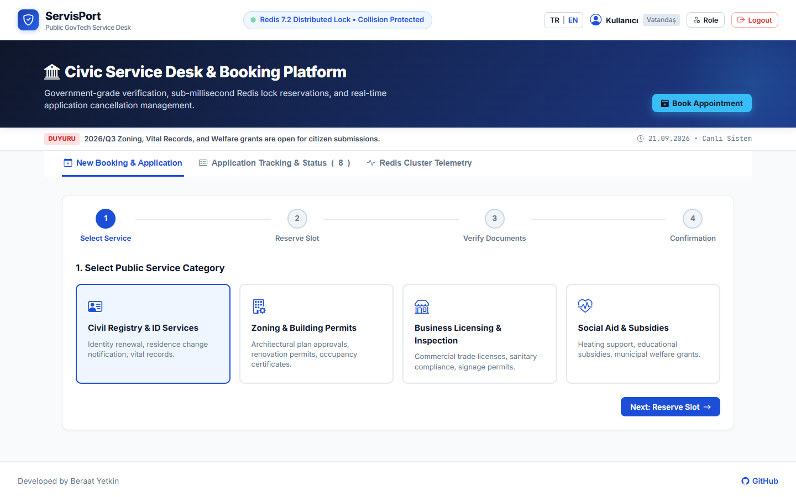
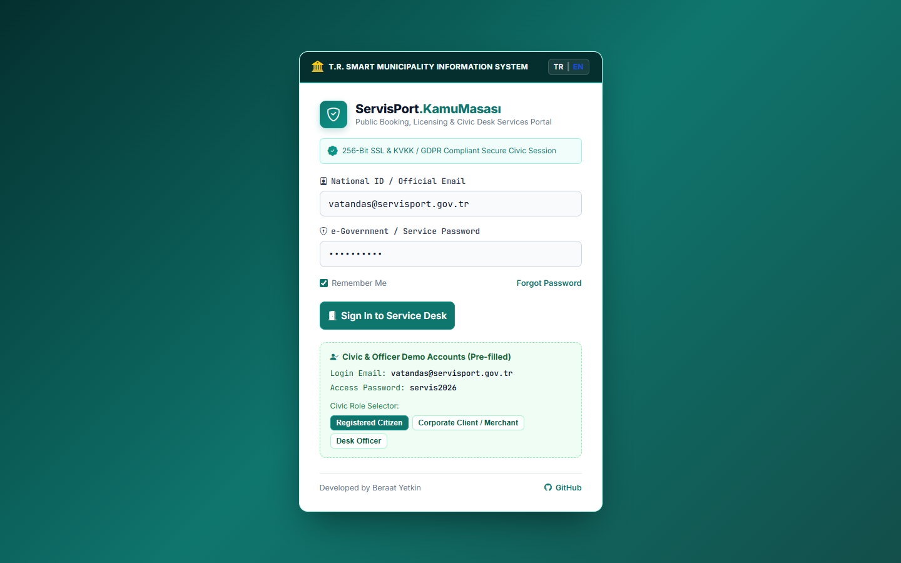

# ServisPort
> Public GovTech Service Desk & Appointment Platform • Redis Distributed Lock Architecture

[](https://servisport.web.app)
[](LICENSE)
[](https://developer.mozilla.org)
[](https://developer.mozilla.org)
[](https://servisport.web.app)

---

## Previews

### 1. Civic Service Desk & Multi-Step Booking Portal
Top announcement ticker, hero discovery area, 4 public service categories, Redis lock-protected appointment wizard, application tracking table, and cancellation/deletion actions:


### 2. Official Civic Desk Login Portal
Official municipal crest header, 256-bit SSL and compliance trust badge, National ID / credentials inputs, and role presets:


---

## Key Features

### Civic Desk GovTech Architecture
- Civic Service Desk:
  - Real-time bulletin ticker displaying open municipal grants and zoning announcements.
  - 4 major public service categories: Civil Registry & ID, Zoning & Building Permits, Business Licensing, and Social Welfare Grants.
- Redis 7.2 Distributed Lock Simulation:
  - Selecting an appointment time slot executes distributed lock commands (SETNX, EXPIRE) with a 10-minute TTL, eliminating double-booking and race conditions.
  - Live Redis event stream and lock latency telemetry.

### Citizen Application Cancellation & Deletion Mechanism
- Dedicated delete action on every registered record triggering an explicit confirmation dialog.
- Slot release: deleting an application immediately purges the record, re-allocates the reserved time slot back to the Redis lock pool, and updates tracking counts.
- LocalStorage persistence keeps canceled bookings purged across sessions.

### Session Persistence & Zero-Flicker Initialization
- Remembers citizen or administrative clearance state across browser reloads via localStorage.
- Inline check prevents login modal flashes during initial page load.
- Secure sign-out action clears active session data and returns to the municipal login portal.
- Pre-filled demo credentials with instant role switches (Registered Citizen, Corporate Client / Merchant, Desk Officer).

### Bilingual Support (English | Turkish)
- Instant language toggle switching all municipal service titles, booking step instructions, form fields, and announcements.
- Default language is English.

---

## Tech Stack

| Layer | Technology | Role |
| :--- | :--- | :--- |
| UI & Layout | HTML5, CSS3 GovTech Palette | Modern civic portal visual hierarchy, 4-step wizard |
| Business Logic | Vanilla JavaScript (ES6+) | Distributed lock pool logic, application tracking |
| Icons | Bootstrap Icons v1.11.3 | Public service and verification icons |
| Storage | HTML5 localStorage | Application records, session state, language preferences |
| Hosting | Firebase Hosting | High-availability HTTPS hosting |

---

## Directory Structure

```
ServisPort/
├── index.html              # Complete single-page application
├── docs/                   # Documentation assets and screenshots
│   ├── preview-dashboard.png # High-resolution service desk preview
│   └── preview-login.png     # High-resolution login portal preview
└── README.md               # Project documentation
```

---

## Getting Started

1. Clone the repository:
   ```bash
   git clone https://github.com/kubrvk/ServisPort.git
   cd ServisPort
   ```
2. Open `index.html` directly in your browser:
   ```bash
   start index.html
   ```
3. Alternatively, serve with any local HTTP server:
   ```bash
   npx serve .
   ```
4. Access `http://localhost:3000` in your browser.
   - To bypass login and view the desk directly: `http://localhost:3000/?demo=1`

---

## Live System

- Live URL: [https://servisport.web.app](https://servisport.web.app)
- Direct Dashboard Link: [https://servisport.web.app/?demo=1](https://servisport.web.app/?demo=1)

---

## Author

Developed by Beraat Yetkin
- GitHub: [@kubrvk](https://github.com/kubrvk)
- Repository: [ServisPort](https://github.com/kubrvk/ServisPort)
- Portfolio: [Beraat Yetkin Portfolio](https://github.com/kubrvk/portfolio)
